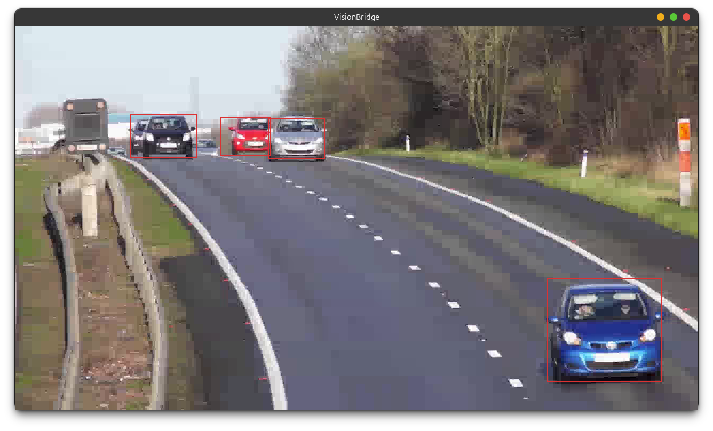

# VisionBridge — VisionBridge Application


VisionBridge is a low-latency, multi-detector surveillance application that captures a live video
stream (webcam or file), runs three parallel object detectors on every frame, streams the
encoded video over RTP to a remote (or local) render node, and overlays colour-coded bounding
boxes on the displayed output — all with a target end-to-end latency under one frame period
(≤ 16.7 ms at 30 fps).

<div align="center">
  <figure>
    
    <figcaption><em>Figure: VisionBridge output.</em></figcaption>
  </figure>
</div>

---

## Table of Contents

1. [Architecture Overview](#architecture-overview)
2. [Object Detectors](#object-detectors)
3. [Data Flows](#data-flows)
4. [Directory Structure](#directory-structure)
5. [Dependencies](#dependencies)
6. [Building](#building)
7. [Configuration](#configuration)
8. [Running](#running)
9. [Performance & Latency Probes](#performance--latency-probes)
10. [Protocol Reference](#protocol-reference)
11. [YOLO Model Setup](#yolo-model-setup)
12. [Extending VisionBridge](#extending-visionbridge)
    - [Adding a new detector](#adding-a-new-detector)
    - [Filtering YOLO detections by class](#filtering-yolo-detections-by-class)
    - [Looping a video file](#looping-a-video-file)
    - [Switching to hardware encode/decode](#switching-to-hardware-encode)
    - [Changing the transport to unicast](#changing-the-transport-to-unicast)

---

## Architecture Overview

```
┌────────────────────────────────────────────────────────────┐   ┌──────────────────────────────────────────┐
│                    SOURCE NODE                             │   │               RENDER NODE                │
│                  visionbridge_source                       │   │             visionbridge_render          │
│                                                            │   │                                          │
│  ┌──────────┐    ┌──────────────────────────────────┐      │   │  ┌──────────────────────────────────┐    │
│  │ v4l2src  │    │           GStreamer tee          │      │   │  │       GStreamer decode pipeline  │    │
│  │  /file   │───▶│  BGRx frame                      │      │   │  │                                  │    │
│  └──────────┘    │  ┌──────────┐   ┌─────────────┐  │      │   │  │  udpsrc ──▶ jitterbuf ──▶        │    │
│                  │  │ appsink  │   │  x264enc    │  │      │   │  │  rtph264depay ──▶ h264parse ──▶  │    │
│                  │  │ branch   │   │  →h264parse │  │      │   │  │  vdec ──▶ videoconvert ──▶       │    │
│                  │  │          │   │  →rtph264pay│  │      │   │  │  RGBA appsink                    │    │
│                  │  └────┬─────┘   │  →udpsink   │  │      │   │  └───────────────┬──────────────────┘    │
│                  │       │         └──────┬──────┘  │      │   │                 │ DecodedFrame           │
│                  └───────┼───────────────┼──────────┘      │   │                 ▼                        │
│                          │               │ H.264 RTP       │   │  ┌──────────────────────────────────┐    │
│                          │               └─────────────────┼───┼─▶│         SDL2 Window              │    │
│                          │ cv::Mat (BGRx zero-copy)        │   │  │  SDL_RenderCopy(texture)         │    │
│                          ▼                                 │   │  │  + DrawRect bbox overlays        │    │
│                  ┌───────────────────┐                     │   │  └──────────────────────────────────┘    │
│                  │  Stub  detector   │──────────┐          │   │                                          │
│                  │  MOG2  detector   │──────────┤ DsMsgBbox│   │                                          │
│                  │  YOLO  detector   │──────────┘          │   │  ┌──────────────────────────────────┐    │
│                  └───────────────────┘                     │   │  │       ZMQ PULL thread            │    │
│                          │ ZMQ PUSH (TCP)                  │   │  │  DsMsgBbox ──▶ latest_bbox       │    │
│                          └─────────────────────────────────┼───┼─▶└──────────────────────────────────┘    │
└────────────────────────────────────────────────────────────┘   └──────────────────────────────────────────┘
```

**Key design choices:**

| Choice | Rationale |
|---|---|
| `tee` with leaky queues | Encode branch never stalls waiting for tracker branch |
| BGRx pixel format | 4-byte aligned rows usable by OpenCV as `CV_8UC4` — zero-copy |
| `x264enc tune=zerolatency` | Sub-frame encode latency; `key-int-max=1` for all-intra encoding |
| ZMQ PUSH/PULL, HWM=1 | Render always sees the *latest* bbox set; backlog impossible |
| `SNDTIMEO=0` on PUSH | ZMQ send never blocks the tracker thread |
| `appsink sync=false drop=true max-buffers=1` | Render always decodes newest frame; no queuing lag |
| RTP jitter buffer = 20 ms | Minimal jitter absorption for a LAN-local stream |

---

## Object Detectors

Three detectors run **simultaneously** on every captured frame.
Each produces its own set of bounding boxes, distinguished by colour on the render display.

### Stub Detector (`DS_DET_STUB` — gray box)

A synthetic placeholder that emits one bounding box following a Lissajous path across the
frame. No real detection is performed. Its purpose is to verify the full pipeline (capture →
ZMQ → render → overlay) before real detection models are available.

### MOG2 Detector (`DS_DET_MOG2` — green boxes)

Uses OpenCV's `BackgroundSubtractorMOG2` to build a background model and extract moving
foreground objects.

| Step | Detail |
|---|---|
| Background model | `history=500`, `varThreshold=16` (configurable) |
| Morphological clean-up | Open (3×3 kernel) to remove small noise, then dilate (7×7) to fill gaps |
| Contour extraction | `RETR_EXTERNAL`, `CHAIN_APPROX_SIMPLE` |
| Area filter | Contour bounding rect area ≥ `mog2_min_area` (default 800 px²) |
| Output cap | Up to 32 boxes (sorted by area, largest first) |

Performs well for fixed-camera scenes with clear background separation.
Not suitable for pan/tilt cameras or rapidly varying lighting.

### YOLO Detector (`DS_DET_YOLO` — red boxes)

Uses OpenCV DNN with a YOLOv4-tiny model (Darknet `.weights+.cfg` or ONNX format).

| Step | Detail |
|---|---|
| Input blob | Resized to `input_width × input_height` (default 416×416), mean-subtracted |
| Backend / target | `DNN_BACKEND_DEFAULT` / `DNN_TARGET_CPU` (CPU inference) |
| Confidence filter | Boxes with confidence below `conf_threshold` (default 0.40) are dropped |
| NMS | `NMSBoxes` with `nms_threshold` (default 0.45) |
| Output cap | Up to 32 boxes per frame |

If model files are missing at startup, `YoloTracker::init()` returns `false` and the
detector is silently disabled — the application continues with the remaining detectors.

Requires OpenCV built with DNN support (`DS_HAVE_OPENCV_DNN` compile definition). Without it
the YOLO tracker compiles as a no-op stub.

---

## Data Flows

### Video Path (RTP)

```
source: v4l2src / filesrc
        │
        ▼  videoconvert → videoscale → videorate
        │  video/x-raw,format=BGRx,width=1280,height=720,framerate=30/1
        │
        ├─── [tracker branch] queue leaky=downstream max-size-buffers=1
        │    └─── appsink  →  on_new_sample()
        │             ├── Stub::process()
        │             ├── MOG2::process()
        │             └── YOLO::process()
        │                  └── aggregate DsMsgBbox → ZMQ PUSH
        │
        └─── [encode branch] queue leaky=downstream max-size-buffers=2
             └─── x264enc tune=zerolatency speed-preset=ultrafast
                  key-int-max=1 bitrate=4000
                  │
                  ├── h264parse
                  └── rtph264pay config-interval=-1 ssrc=987654321 pt=96 mtu=1400
                       └── udpsink host=239.1.1.1 port=5004 auto-multicast=true sync=false

render: udpsrc port=5004 multicast-group=239.1.1.1
        │ caps: application/x-rtp,media=video,clock-rate=90000,encoding-name=H264
        ├── rtpjitterbuffer latency=20 drop-on-latency=true
        ├── rtph264depay
        ├── h264parse name=vparser
        ├── avdec_h264 / vaapih264dec  name=vdec
        ├── videoconvert
        └── video/x-raw,format=RGBA
             └── appsink sync=false drop=true max-buffers=1
                  └── on_new_sample() → DecodedFrame → DisplayOutput::update_frame()
```

### Bounding-Box Path (ZMQ)

```
source tracker thread    → zmq_send(DsMsgBbox, ZMQ_NOBLOCK)
                              │  ZMQ PUSH, HWM=1, SNDTIMEO=0
                              │  transport: TCP (default tcp://*:5560)
                              ▼
render ZMQ PULL thread   ← zmq_recv(DsMsgBbox)
                              │  ZMQ PULL, HWM=1, RCVTIMEO=100ms
                              ▼
                          m_latest_bbox  (shared_ptr, mutex-guarded)
                              ▼
render main thread        DisplayOutput::present() → draw_bboxes()
```

---

## Directory Structure

```
visionbridge/
├── CMakeLists.txt          CMake build definition (standalone or embedded)
├── meson.build             Meson build definition
├── build_cmake.sh          CMake build helper script
├── build_meson.sh          Meson build helper script
│
├── common/                 Shared code (compiled into ds_common static lib)
│   ├── config.h            All config structs (DsSourceConfig, DsRenderConfig, ...)
│   ├── config_loader.h/cpp JSON → config struct parsing (nlohmann/json)
│   ├── logger.h/cpp        DS_ERR/WARN/INFO/DBG/TRACE macros, ANSI colours
│   ├── pipeline_stats.h    LatencyStats: count/sum/min/max with reset_and_return()
│   ├── protocol.h          ZMQ wire types: DsBbox, DsMsgBbox, DS_DETECTOR_ID enum
│   └── time_utils.h        ds_mono_us(), ds_realtime_us(), ds_sleep_ms()
│
├── configs/
│   ├── source.json         Default source node configuration
│   └── render.json         Default render node configuration
│
├── source/                 visionbridge_source executable
│   ├── tracker.h           ITracker abstract interface
│   ├── stub_tracker.h/cpp  Lissajous-path synthetic detector
│   ├── mog2_tracker.h/cpp  OpenCV BackgroundSubtractorMOG2 + contours
│   ├── yolo_tracker.h/cpp  OpenCV DNN YOLOv4-tiny (optional)
│   ├── capture_pipeline.h/cpp  GStreamer tee pipeline + timing probes
│   ├── source_node.h/cpp   Orchestrator: trackers + pipeline + ZMQ PUSH
│   └── main.cpp            CLI entry point
│
├── render/                 visionbridge_render executable
│   ├── stream_decoder.h/cpp    GStreamer RTP receive + decode pipeline
│   ├── display_output.h/cpp    SDL2 window + ZMQ PULL thread + bbox overlay
│   ├── render_node.h/cpp       Orchestrator: decoder + display
│   └── main.cpp                CLI entry point
│
└── models/                 (user-provided YOLO model files — not bundled)
    ├── yolov4-tiny.weights
    ├── yolov4-tiny.cfg
    └── coco.names
```

---

## Dependencies

| Library | Purpose | Install (Ubuntu/Debian) |
|---|---|---|
| GStreamer 1.0 core | Pipeline framework | `libgstreamer1.0-dev` |
| GStreamer app | appsink/appsrc elements | `libgstreamer-plugins-base1.0-dev` |
| GStreamer video | videoconvert, videoscale | `libgstreamer-plugins-base1.0-dev` |
| GStreamer rtp | rtph264pay/depay, rtpjitterbuffer | `libgstreamer-plugins-bad1.0-dev` |
| GStreamer good | v4l2src, udpsink/src, x264enc | `gstreamer1.0-plugins-good` |
| GStreamer ugly | x264enc | `gstreamer1.0-plugins-ugly` |
| GStreamer libav | avdec_h264 software decoder | `gstreamer1.0-libav` |
| GStreamer vaapi | vaapih264dec hardware decoder | `gstreamer1.0-vaapi` (optional) |
| SDL2 | Window creation, rendering, input | `libsdl2-dev` |
| ZeroMQ | PUSH/PULL bbox channel | `libzmq3-dev` |
| OpenCV 4 | core, imgproc, video, dnn | `libopencv-dev` |
| nlohmann/json | JSON config parsing | `nlohmann-json3-dev` |
| pthread / rt | Threading and POSIX clocks | (system) |

**Quick install:**
```bash
sudo apt install \
  libgstreamer1.0-dev libgstreamer-plugins-base1.0-dev \
  libgstreamer-plugins-bad1.0-dev \
  gstreamer1.0-plugins-good gstreamer1.0-plugins-ugly \
  gstreamer1.0-libav gstreamer1.0-vaapi \
  libsdl2-dev libzmq3-dev libopencv-dev nlohmann-json3-dev
```

---

## Building

Both build systems produce two executables: `visionbridge_source` and `visionbridge_render`.

### CMake (recommended for standalone development)

```bash
# From visionbridge/ directory:
./build_cmake.sh                        # Release build
./build_cmake.sh Debug                  # Debug build
./build_cmake.sh RelWithDebInfo clean   # Clean + rebuild with debug info

# Or manually:
mkdir build && cd build
cmake .. -DCMAKE_BUILD_TYPE=Release
make -j$(nproc)
```

### Meson (recommended for integration with the vsync project)

```bash
# From visionbridge/ directory:
./build_meson.sh                        # release build
./build_meson.sh debug                  # debug build
./build_meson.sh debugoptimized clean   # clean + rebuild

# Or from the repo root:
meson setup build -Dbuild_visionbridge=true --buildtype=release
ninja -C build visionbridge/visionbridge_source visionbridge/visionbridge_render
```

### Building as part of the vsync project (CMake)

```bash
# From the repo root:
cmake .. -DBUILD_VISIONBRIDGE=ON -DCMAKE_BUILD_TYPE=Release
make -j$(nproc)
```

### YOLO build flag

When OpenCV DNN is available (it is in standard `libopencv-dev`), the build system
automatically adds `-DDS_HAVE_OPENCV_DNN=1`, enabling the YOLO tracker.
Without it, the YOLO tracker compiles as a graceful no-op.

---

## Configuration

Both nodes are configured via JSON files. All fields have sensible defaults —
you only need to override what differs from the defaults.

### Source config (`configs/source.json`)

```json
{
    "input": {
        "type":    "webcam",        // "webcam" | "file"
        "device":  "/dev/video0",   // V4L2 device (webcam mode)
        "file":    "",              // path to video file (file mode)
        "width":   1280,
        "height":  720,
        "fps_num": 30,
        "fps_den": 1,
        "loop":    true             // loop file input on EOS (ignored for webcam)
    },
    "detectors": {
        "enable_stub": true,
        "enable_mog2": true,
        "enable_yolo": true,        // silently disabled if model files missing
        "mog2_history":       500,
        "mog2_var_threshold": 16.0,
        "mog2_min_area":      800,  // minimum contour area in px²
        "yolo": {
            "model":          "models/yolov4-tiny.weights",
            "config":         "models/yolov4-tiny.cfg",
            "names":          "models/coco.names",
            "conf_threshold": 0.40,
            "nms_threshold":  0.45,
            "input_width":    416,
            "input_height":   416,
            "filter_classes": []    // empty = all classes; e.g. ["car","person"]
        }
    },
    "transport": {
        "host":          "239.1.1.1",   // multicast group or unicast IP
        "rtp_port":      5004,
        "iface":         "",            // source NIC IP (empty = default route)
        "multicast":     true,
        "multicast_ttl": 4
    },
    "codec": {
        "bitrate_kbps": 4000,
        "keyint":       1,              // 1 = all-intra (lowest latency)
        "hw_encode":    false,          // true = vaapih264enc (needs gst-vaapi)
        "hw_decode":    false           // unused on source side
    },
    "zmq": {
        "source_endpoint": "tcp://*:5560"
    },
    "debug": {
        "log_level":        2,          // 0=ERR 1=WARN 2=INFO 3=DBG 4=TRACE
        "stats_interval_s": 1           // 0 = disable all timing probes
    }
}
```

### Render config (`configs/render.json`)

```json
{
    "transport": {
        "host":      "239.1.1.1",
        "rtp_port":  5004,
        "multicast": true
    },
    "codec": {
        "hw_decode": false              // set true to use vaapih264dec (runtime probe)
    },
    "zmq": {
        "render_endpoint": "tcp://127.0.0.1:5560"
    },
    "jitter_buffer_ms": 20,
    "display": {
        "width":  1280,
        "height": 720,
        "title":  "VisionBridge — Surveillance Render",
        "fullscreen": false,
        "sdl_display_index": -1         // -1 = primary display
    },
    "debug": {
        "log_level":        2,
        "stats_interval_s": 1
    }
}
```

---

## Running

### Same machine (loopback / localhost)

```bash
# Terminal 1 — source (multicast default, renders locally)
./build/visionbridge_source --config configs/source.json

# Terminal 2 — render
./build/visionbridge_render --config configs/render.json
```

### Separate machines — Multicast (default)

Multicast is the default; both nodes join the same multicast group over the LAN.
No IP-specific configuration needed as long as both machines are on the same subnet.

```bash
# Source machine (multicast default from source.json: 239.1.1.1:5004)
./build/visionbridge_source --config configs/source.json

# Render machine
./build/visionbridge_render --config configs/render.json
# render.json already has transport.host = 239.1.1.1 by default
```

Override the multicast group from the CLI:
```bash
./build/visionbridge_source --multicast 239.2.2.2
./build/visionbridge_render --multicast 239.2.2.2
```

### Separate machines — Unicast

For unicast the source sends directly to the render machine's IP.

```bash
# Source machine — send unicast RTP to render at 192.168.1.20
./build/visionbridge_source --dest 192.168.1.20

# Render machine — receive from source at 192.168.1.10
./build/visionbridge_render --unicast 192.168.1.10
```

Or using the auto-detecting `--source` flag on the render (non-multicast IP detected automatically):
```bash
./build/visionbridge_render --source 192.168.1.10
```

`--source` checks the IP address: if it falls in the `224.x.x.x–239.x.x.x` multicast range
it sets `multicast=true`, otherwise it sets `multicast=false` (unicast).

### Transport mode summary

| Goal | Source command | Render command |
|---|---|---|
| Multicast (default) | *(use source.json)* | *(use render.json)* |
| Multicast explicit | `--multicast 239.1.1.1` | `--multicast 239.1.1.1` |
| Unicast explicit | `--dest 192.168.1.20` | `--unicast 192.168.1.10` |
| Unicast auto-detect | `--dest 192.168.1.20` | `--source 192.168.1.10` |
| Multicast auto-detect | `--multicast 239.1.1.1` | `--source 239.1.1.1` |

### Using a video file as input

```bash
./build/visionbridge_source --file /path/to/video.mp4
# or via config:
"input": { "type": "file", "file": "/path/to/video.mp4", "loop": true }
```

The file loops indefinitely by default (`"loop": true`). Set `"loop": false` to stop the
source when playback reaches the end.

### CLI reference

**visionbridge_source**
```
  -c, --config <file>       Source config JSON  [default: configs/source.json]
  -w, --webcam [device]     Override input to webcam  [default: /dev/video0]
  -f, --file <path>         Override input to video file
  -d, --dest <host>         Send RTP unicast to specific host (disables multicast)
  -m, --multicast [group]   Send RTP to multicast group  [default: 239.1.1.1]
  -l, --log-level <lvl>     error | warn | info | debug | trace  [default: info]
  -h, --help
```

**visionbridge_render**
```
  --config <path>            Render config JSON  [default: configs/render.json]
  --source <host>            Override source IP, auto-detect multicast vs unicast
                             (224.x.x.x-239.x.x.x → multicast, else unicast)
  --unicast <host>           Set unicast source IP (explicit, disables multicast)
  --multicast <group>        Set multicast group (explicit, enables multicast)
  --log-level <0-4>          0=OFF 1=ERR 2=INFO 3=DBG 4=TRACE  [default: 2]
  --help
```

---

## Performance & Latency Probes

When `stats_interval_s > 0` (default: 1 second), GStreamer pad probes and a GLib timer
are attached to measure and periodically log pipeline latencies.

Setting `stats_interval_s = 0` **disables all probes** and the timer entirely — zero
overhead for production or benchmarking use.

### Source probes

| Probe point | Metric logged |
|---|---|
| `venc` sink pad | Encode entry timestamp |
| `venc` src pad | `encode_lat` = now − entry (µs) — skips HEADER-only buffers |
| `vpay` src pad | `payload_lat` = now − enc_out_ts (µs) |
| appsink callback (per tracker) | `tracker_lat[stub/mog2/yolo]` = wall time of `process()` call |

### Render probes

| Probe point | Metric logged |
|---|---|
| `h264parse` src pad | `pre_dec_ts` — start of decode path |
| `vdec` sink pad | `vdec_sink_ts` — decoder entry |
| `vdec` src pad | `pure_decode_lat` = now − vdec_sink_ts (µs) |
| appsink sink pad | `total_decode_lat` = now − pre_dec_ts (µs) |

### Sample log output

```
[TIMING-SRC]  encode_lat:  cnt=30 avg=2140 min=1870 max=2980 us
[TIMING-SRC]  payload_lat: cnt=30 avg= 120 min= 100 max= 310 us
[TIMING-SRC]  tracker_lat[stub]: cnt=30 avg=  12 min=  10 max=  18 us
[TIMING-SRC]  tracker_lat[mog2]: cnt=30 avg=3200 min=2800 max=4100 us
[TIMING-SRC]  tracker_lat[yolo]: cnt=30 avg=31ms min=28ms max=36ms us
[TIMING-RECV] decode_pure:  cnt=30 avg=1800 min=1600 max=2400 us
[TIMING-RECV] decode_total: cnt=30 avg=2200 min=1900 max=2900 us
[E2E latency capture→display]  avg=42.3 ms  min=29.1 ms  max=68.7 ms  samples=30
```

### End-to-end latency (capture → display)

The render node measures the full pipeline latency: from the moment the source appsink
callback fires (i.e. the raw frame is first touched by the CPU) to the moment
`SDL_RenderPresent()` commits the frame to the display.

The timestamp is carried inside the ZMQ `DsMsgBbox` message as `capture_ts_us`
(sourced from `CLOCK_REALTIME`). On the render side, `ds_realtime_us()` is read
right after `SDL_RenderPresent()` and the delta is accumulated into a running average.

**Clock requirements:**

| Setup | Accuracy |
|---|---|
| Same machine | Exact — shared `CLOCK_REALTIME` |
| Two machines, NTP/chrony synced | ±1–5 ms typical |
| Two machines, PTP/ptp4l synced (recommended) | ±0.1–0.5 ms |
| No sync | Latency values reflect clock offset — relative changes still meaningful |

Samples where `latency > 10 s` are discarded as clock-skew protection.
The accumulator resets every `stats_interval_s` seconds.

> **Note:** YOLO inference on CPU typically takes 25–50 ms per frame at 416×416 on modern
> hardware. Because the tracker branch uses a leaky queue (`leaky=downstream max-size-buffers=1`),
> slow YOLO inference **does not stall** the encode/RTP path — it simply processes fewer
> frames per second on the detection side.

---

## Protocol Reference

### `DsMsgBbox` — ZMQ wire message (protocol version 2)

Sent once per frame over ZMQ PUSH/PULL, containing all detections from all enabled detectors.

```
Offset  Size  Field              Description
──────  ────  ─────────────────  ──────────────────────────────────────────────
  0       1   type               0x01 = DS_MSG_BBOX
  1       1   protocol_version   2
  2       2   _pad               (reserved, set to 0)
  4       8   frame_seq          monotonically increasing frame counter
 12       8   capture_ts_us      CLOCK_REALTIME when frame entered appsink (µs)
                                  — used for capture-to-display latency measurement
 20       8   send_ts_us         CLOCK_REALTIME just before zmq_send (µs)
                                  — delta vs capture_ts_us = tracker pipeline cost
 28       4   bbox_count         number of valid DsBbox entries in bboxes[]
 32  ≤2304   bboxes[96]         up to 96 DsBbox entries (32 per detector)
```

**Protocol version history:**

| Version | Change |
|---|---|
| 1 | Initial: `send_ts_us` only |
| 2 | Added `capture_ts_us` before `send_ts_us` for E2E latency measurement |

### `DsBbox` — one bounding box

```
Offset  Size  Field        Description
──────  ────  ───────────  ──────────────────────────────────────────────────
  0       4   x            top-left X (source frame pixel coordinates)
  4       4   y            top-left Y
  8       4   w            box width
 12       4   h            box height
 16       4   confidence   float in [0..1]; 1.0 for MOG2 / Stub (no score)
 20       1   detector_id  0=STUB 1=MOG2 2=YOLO
 21       3   _pad
```

Total message size: 24 + 96×24 = **2328 bytes**. Fits in a single UDP MTU-sized ZMQ frame.

### Detector IDs and colours

| ID | Name | Colour |
|---|---|---|
| 0 | `DS_DET_STUB` | Gray (180, 180, 180) |
| 1 | `DS_DET_MOG2` | Green (50, 220, 50) |
| 2 | `DS_DET_YOLO` | Red (220, 50, 50) |

---

## YOLO Model Setup

VisionBridge does **not** bundle YOLO model files. Download them separately:

```bash
# Create models directory
mkdir -p visionbridge/models
cd visionbridge/models

# YOLOv4-tiny weights and config (AlexeyAB Darknet)
wget https://github.com/AlexeyAB/darknet/releases/download/darknet_yolo_v4_pre/yolov4-tiny.weights
wget https://raw.githubusercontent.com/AlexeyAB/darknet/master/cfg/yolov4-tiny.cfg

# COCO class names
wget https://raw.githubusercontent.com/AlexeyAB/darknet/master/data/coco.names
```

Then set the paths in `configs/source.json`:
```json
"yolo": {
    "model":  "models/yolov4-tiny.weights",
    "config": "models/yolov4-tiny.cfg",
    "names":  "models/coco.names"
}
```

**ONNX alternative:** Set `model` to a `.onnx` file and leave `config` empty.
OpenCV DNN will auto-detect the format.

**GPU acceleration:** Change the backend/target in `yolo_tracker.cpp`:
```cpp
m_net.setPreferableBackend(cv::dnn::DNN_BACKEND_CUDA);
m_net.setPreferableTarget(cv::dnn::DNN_TARGET_CUDA);
```
Requires OpenCV built with CUDA support and an NVIDIA GPU.

---

## Extending VisionBridge

### Adding a new detector

1. Create `source/my_tracker.h` and `source/my_tracker.cpp` implementing `ITracker`:

```cpp
class MyTracker : public ITracker {
public:
    bool init(int width, int height) override;
    std::vector<DsBbox> process(const cv::Mat& frame) override;
    const char* name() const override { return "mydet"; }
};
```

2. Assign a new `DS_DETECTOR_ID` value in `common/protocol.h`.

3. Add a colour entry in `render/display_output.cpp` → `color_for_id()`.

4. Instantiate the tracker in `source/source_node.cpp` alongside the existing three.

5. Add the new `.cpp` to `CMakeLists.txt` and `meson.build`.

### Switching to hardware encode/decode {#switching-to-hardware-encode}

Edit `configs/source.json` for hardware encode:
```json
"codec": { "hw_encode": true }
```
The `CapturePipeline` will substitute `vaapih264enc` for `x264enc` when `hw_encode=true`.

For hardware decode on the render side, set `"hw_decode": true` in `configs/render.json`.
The decoder is probed at runtime by attempting to set `vaapih264dec` to `READY` state — if
the hardware is unavailable it falls back to software (`avdec_h264`) automatically.

### Changing the transport to unicast

From the CLI (no config file edits needed):
```bash
./build/visionbridge_source --dest 192.168.1.20        # unicast to render machine
./build/visionbridge_render --unicast 192.168.1.10     # receive from source machine
```

Or via `configs/source.json` and `configs/render.json`:
```json
// source.json
"transport": { "host": "192.168.1.20", "rtp_port": 5004, "multicast": false }

// render.json
"transport": { "host": "192.168.1.10", "rtp_port": 5004, "multicast": false }
```

### Disabling individual detectors

```json
"detectors": {
    "enable_stub": false,
    "enable_mog2": true,
    "enable_yolo": false
}
```

### Filtering YOLO detections by class

By default YOLO reports all 80 COCO classes. Use `filter_classes` to restrict output
to specific object types (matched case-insensitively against `coco.names`):

```json
"yolo": {
    "filter_classes": ["car", "truck", "bus", "motorbike"]  // vehicles only
}
```

```json
"yolo": {
    "filter_classes": ["person"]   // people only
}
```

```json
"yolo": {
    "filter_classes": []          // empty = all 80 COCO classes (default)
}
```

At startup, each active filter class is logged:
```
YoloTracker: filtering class 'car' (id=2)
YoloTracker: filtering class 'truck' (id=7)
```

### Looping a video file

When `input.type = "file"`, set `loop = true` (the default) to automatically seek
back to the start on EOS rather than stopping the pipeline:

```json
"input": { "type": "file", "file": "video.mp4", "loop": true }
```

Set `"loop": false` to stop the source node when the file ends.

### Reducing latency further

- Set `keyint=1` (already default) — all-intra encoding; every frame is independently decodable.
- Reduce `jitter_buffer_ms` to 5–10 ms on a reliable LAN (`configs/render.json`).
- Increase `bitrate_kbps` to reduce DCT artifacts (at the cost of bandwidth).
- Enable hardware decode on the render: `"hw_decode": true`.
- Set `stats_interval_s=0` to remove all probe overhead.


### Video file download
Sample video file can be downloaded from
https://pixabay.com/videos/cars-motorway-speed-motion-traffic-1900/